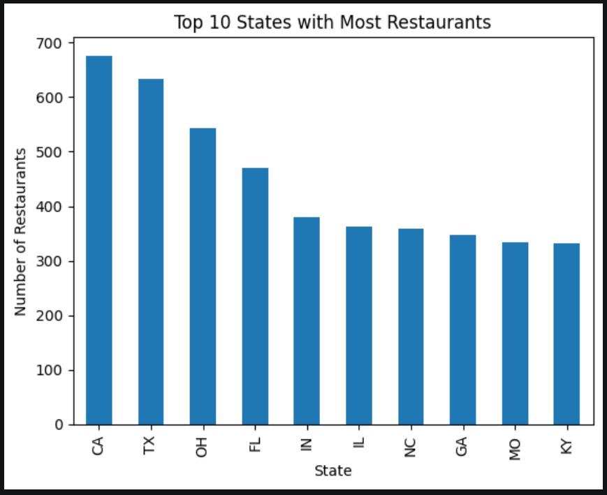
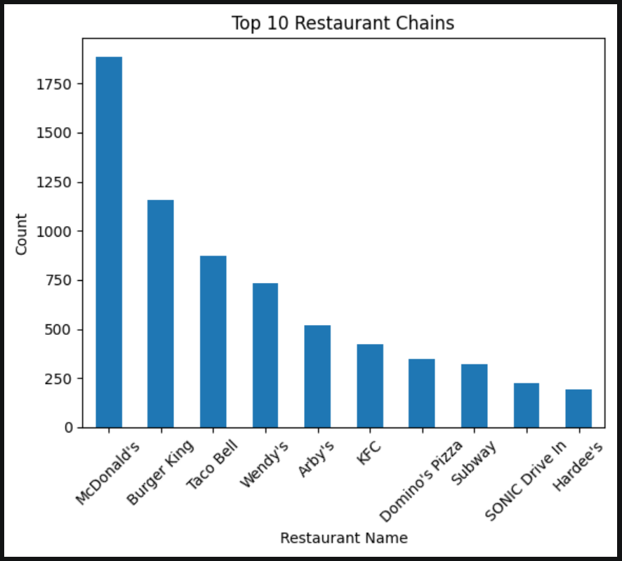
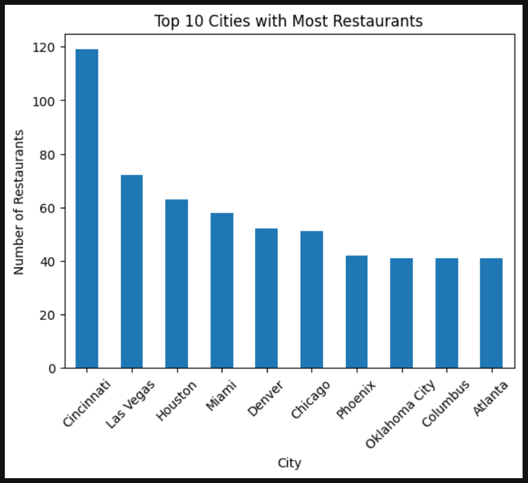

# 🍔 Restaurant Analytics Project (USA)

## 📌 Overview

This project analyzes fast-food restaurant data across the United States using Python.

---

## 🛠 Tools Used

* Python (Pandas, Matplotlib)
* Jupyter Notebook

---

## 📊 Key Insights

* California has the highest number of restaurants
* McDonald's is the most common restaurant chain
* Cincinnati has the highest restaurant concentration
* Texas has the most McDonald's locations

---

## 📈 Visualizations

### Top States

### Top Brands

### Top Cities

---

## 🚀 Conclusion

This project demonstrates how data analysis can uncover patterns in restaurant distribution and business opportunities.

---

## 💼 Author
Vidyadhari Chennuri
